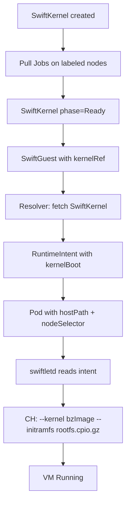

# KubeSwift Architecture

KubeSwift is **Cloud-Hypervisor-native**: it uses Cloud Hypervisor as the sole VMM. There is no libvirt, no QEMU, no multi-hypervisor abstraction. The design is intentionally narrow.

## Why Cloud Hypervisor only?

- **Simplicity** — One hypervisor, one integration path. No abstraction layer to maintain.
- **Cloud focus** — Cloud Hypervisor targets modern Linux cloud images and virtio devices.
- **Explicit VM semantics** — Start, stop, restart are first-class; no VM-as-pod indirection.

## Design principles

| Principle | Meaning |
|-----------|---------|
| **Cloud Hypervisor only** | No libvirt/QEMU; direct Unix-socket integration |
| **One guest per pod** | Each SwiftGuest becomes one pod; swiftletd runs as the launcher container |
| **Kubernetes-native** | Scheduling, networking, storage via standard Kubernetes primitives |
| **Two boot paths** | Disk boot (cloud images with GRUB/firmware) and kernel boot (direct bzImage + initramfs) |

## API groups

| Group | CRDs | Purpose |
|-------|------|---------|
| `swift.kubeswift.io` | SwiftGuest, SwiftGuestClass | VM instances and class templates |
| `image.kubeswift.io` | SwiftImage | Disk image sources (HTTP, PVC clone) |
| `seed.kubeswift.io` | SwiftSeedProfile | Cloud-init datasource (NoCloud) |
| `kernel.kubeswift.io` | SwiftKernel | Kernel + initramfs OCI artifacts |

All CRDs are `v1alpha1`.

## Components

| Component | Where it runs | Purpose |
|-----------|---------------|---------|
| **controller-manager** | Cluster (Deployment) | SwiftImage + SwiftGuest + SwiftKernel controllers; optional admission webhooks |
| **swiftletd** | Inside each SwiftGuest pod (launcher container) | Reads runtime intent, builds NoCloud seed or passes kernel args, launches Cloud Hypervisor, reports status |
| **swiftctl** | CLI | Operator tooling |
| **Helm chart** | OCI registry | `oci://ghcr.io/projectbeskar/charts/kubeswift` |

## Boot paths

KubeSwift supports two mutually exclusive boot paths on SwiftGuest. The `imageRef` and `kernelRef` fields select which path is used.

### Disk boot (imageRef)

The original boot path. Uses a cloud disk image (raw or qcow2) with rust-hypervisor-firmware as the PVH bootloader. Supports cloud-init via SwiftSeedProfile for user-data, networking, and SSH keys.

1. **Operator** creates SwiftGuest referencing SwiftImage and optionally SwiftSeedProfile.
2. **SwiftGuest controller** resolves refs, renders NoCloud seed, creates runtime-intent ConfigMap.
3. **Controller** creates a Pod with: root-disk PVC, seed ConfigMap volume (if present), runtime-intent ConfigMap.
4. **swiftletd** reads intent, builds NoCloud ISO from seed data, spawns Cloud Hypervisor with `--kernel hypervisor-fw --disk path=<root.raw> path=<seed.iso>`.
5. **Cloud Hypervisor** boots via firmware → GRUB → Linux kernel (from disk); swiftletd patches status.

### Kernel boot (kernelRef)

The direct kernel boot path. Uses a pre-built Linux kernel (bzImage) and initramfs pulled as OCI artifacts. No firmware, no GRUB, no cloud-init. Designed for purpose-built microVMs with sub-second cold start.

1. **Operator** labels nodes with `kubeswift.io/kernel-node=true`.
2. **Operator** creates SwiftKernel referencing an OCI artifact containing bzImage + rootfs.cpio.gz.
3. **SwiftKernel controller** creates a pull Job on each labeled node. Artifacts land at `/var/lib/kubeswift/kernels/<namespace>-<name>/`.
4. **Operator** creates SwiftGuest with `kernelRef` (instead of `imageRef`).
5. **SwiftGuest controller** resolves SwiftKernel (must be Ready), builds runtime-intent with `kernelBoot` field.
6. **Controller** creates a Pod with: hostPath volume for kernel artifacts, runtime-intent ConfigMap, nodeSelector `kubeswift.io/kernel-node=true`. No PVC, no seed volume, no network-init container.
7. **swiftletd** reads intent, spawns Cloud Hypervisor with `--kernel <bzImage> --initramfs <rootfs.cpio.gz> --cmdline <cmdline>`.
8. **Cloud Hypervisor** boots directly into the kernel; swiftletd patches status.

### Key differences

| Aspect | Disk boot | Kernel boot |
|--------|-----------|-------------|
| Boot source | SwiftImage (PVC with raw/qcow2) | SwiftKernel (hostPath with bzImage + initramfs) |
| Firmware | rust-hypervisor-firmware | None (direct kernel) |
| Cloud-init | SwiftSeedProfile (NoCloud ISO) | Not supported |
| Network | TAP + DHCP via network-init | Not configured |
| Pod volumes | root-disk PVC, seed ConfigMap | kernel-artifacts hostPath |
| Node targeting | Any schedulable node | `kubeswift.io/kernel-node=true` |
| CH invocation | `--kernel hypervisor-fw --disk ...` | `--kernel bzImage --initramfs ... --cmdline ...` |

See [control plane](architecture/control-plane.md), [node runtime](architecture/node-runtime.md), [lifecycle](architecture/lifecycle.md).
