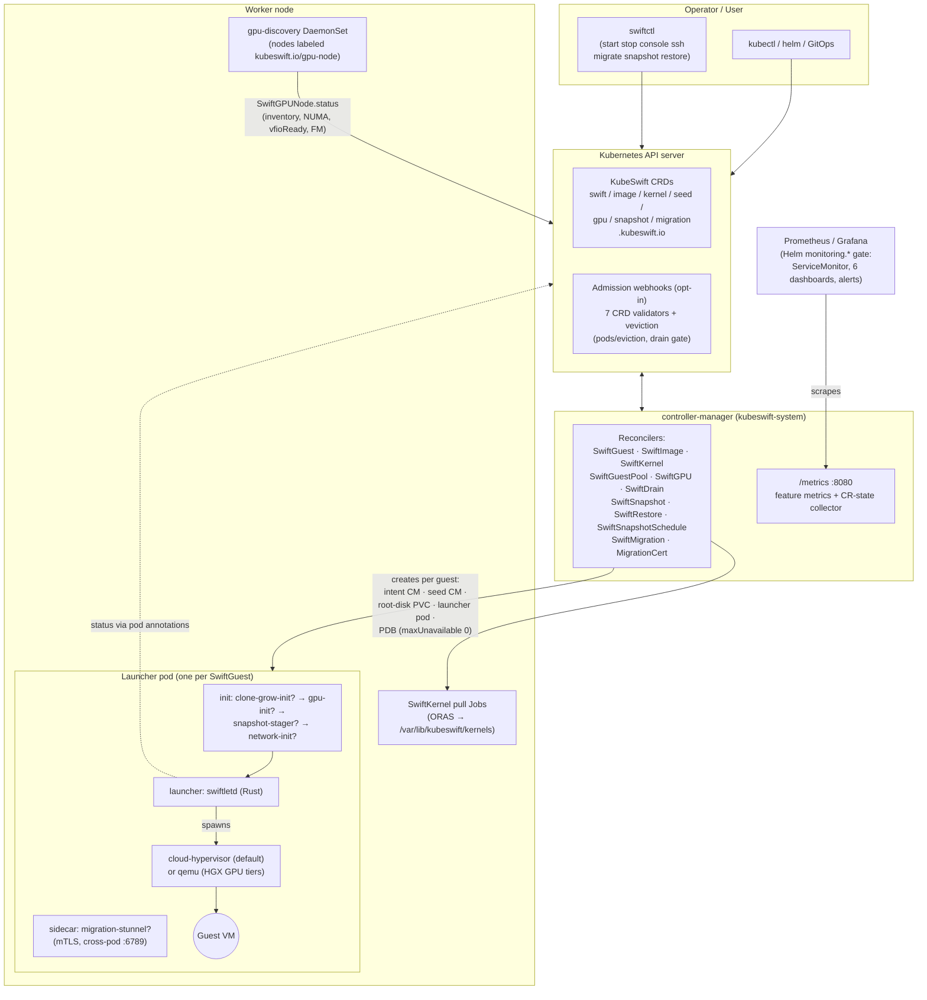
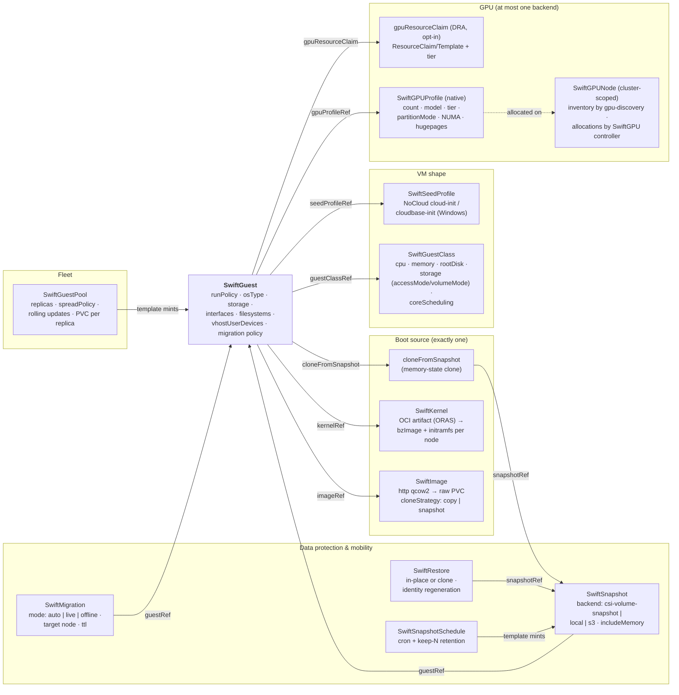
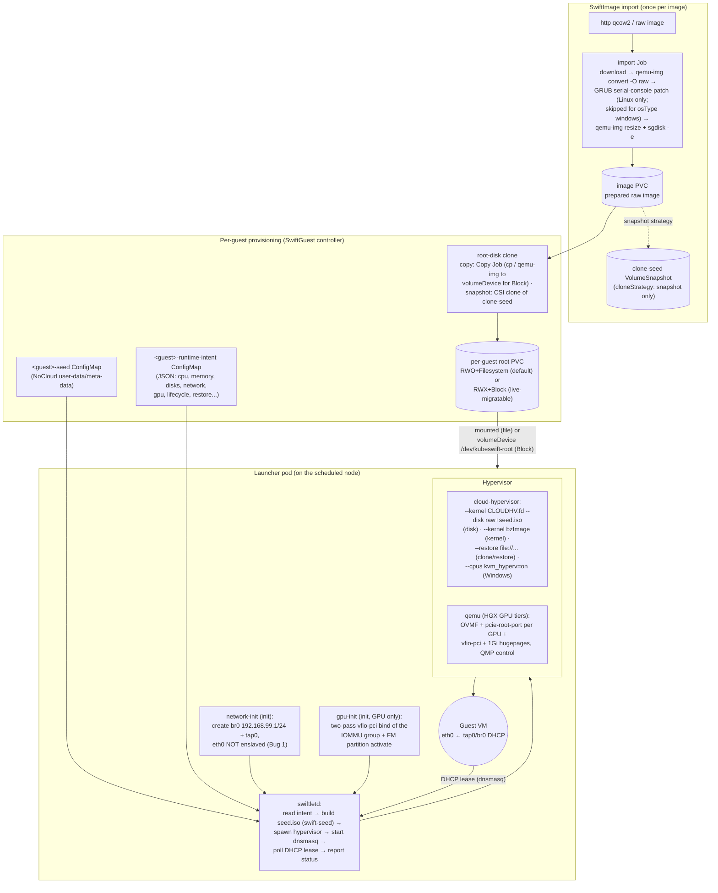
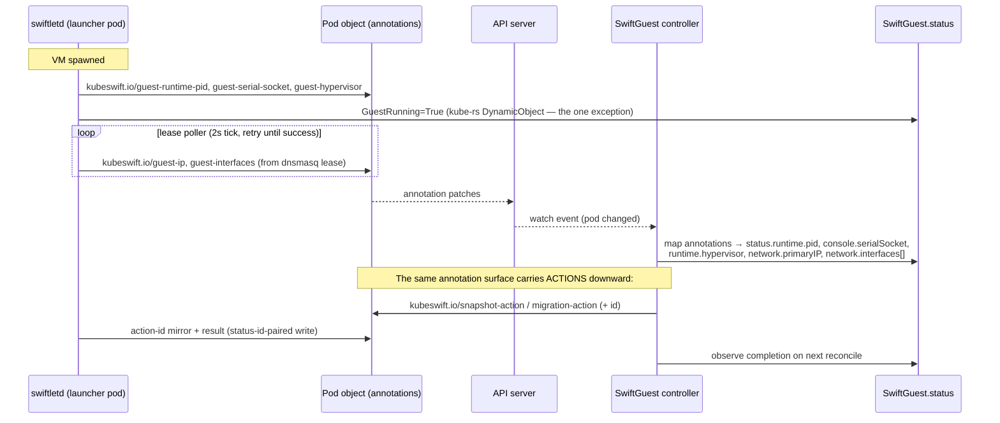
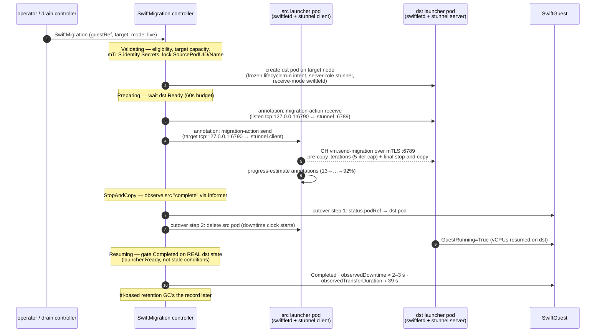
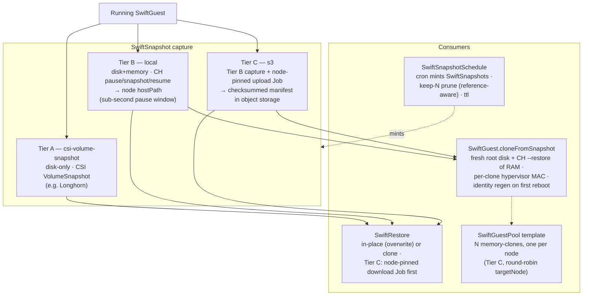

# KubeSwift architecture — visual reference

Diagrams of KubeSwift's components, their interactions, and the data paths.
All diagrams are Mermaid and render directly on GitHub. Companion prose:
[architecture.md](../architecture.md), [control-plane.md](control-plane.md),
[node-runtime.md](node-runtime.md), [lifecycle.md](lifecycle.md).

Contents:

1. [System overview](#1-system-overview)
2. [CRD relationship map](#2-crd-relationship-map)
3. [Launcher pod anatomy & boot data path](#3-launcher-pod-anatomy--boot-data-path)
4. [Status reporting path](#4-status-reporting-path)
5. [Live migration sequence](#5-live-migration-sequence)
6. [Snapshot, restore & fast clones](#6-snapshot-restore--fast-clones)

---

## 1. System overview

Every box is a real deployable or a Kubernetes object. One controller-manager
hosts all reconcilers and (when `webhook.enabled`) all admission webhooks; the
only other long-running KubeSwift components are the per-guest **launcher pods**
and the opt-in **gpu-discovery DaemonSet**. VMs are pods: each SwiftGuest gets
one launcher pod whose `launcher` container runs `swiftletd`, which spawns the
hypervisor in-pod.

Key properties this encodes:

- **The API server is the only bus.** Controllers and swiftletd never talk to
  each other directly — coordination is CRD status, ConfigMaps and pod
  annotations (the one cross-pod TCP exception is live migration's CH-to-CH
  transfer, §5).
- **RestartPolicy of launcher pods is always `Never`**; the SwiftGuest
  controller owns restarts via `runPolicy`.
- The `?` init containers are conditional: `gpu-init` only for GPU guests,
  `snapshot-stager`/`clone-grow-init` only for restore/clone boots,
  `network-init` when the guest has networking, the stunnel sidecar only when
  `migration.mtls.enabled` and the guest is migration-eligible.

---

## 2. CRD relationship map

What references what. `SwiftGuest` is the hub; everything else either feeds it
(images, kernels, classes, seeds, GPU profiles) or operates on it (snapshots,
restores, migrations, pools, schedules).

Constraint highlights (enforced by the SwiftGuest webhook): `imageRef` /
`kernelRef` / `cloneFromSnapshot` are mutually exclusive boot sources;
`gpuProfileRef` XOR `gpuResourceClaim`; GPU combines with `imageRef` but never
`kernelRef`; `osType: windows` is disk-boot only and GPU-less in v1;
RWX+Filesystem storage is rejected (RWX+Block is the live-migration-capable
combination).

---

## 3. Launcher pod anatomy & boot data path

The disk-boot data path end to end — from a qcow2 URL to a running VM with an
IP — including where every artifact lives and which component produces it.

Notes:

- **Runtime disks are always raw**; qcow2 is input-only. `CLOUDHV.fd` loads via
  `--kernel`, never `--firmware` (that flag is for OVMF on the QEMU path).
- The guest network is **node-local by default**: each launcher pod has its own
  `br0` (192.168.99.0/24) + dnsmasq, so guest IPs are per-pod and change across
  nodes — the reason cross-node migration needs `allowIPChange` or a multi-node
  NAD on the primary interface.
- Kernel-boot guests skip the whole import/clone column — no PVC at all, which
  is why they are the lightest guests to live-migrate.
- swiftletd talks to CH over its HTTP API on a Unix socket (`ch.sock`) and to
  QEMU over QMP; the serial console is a Unix socket consumed by
  `swiftctl console`.

---

## 4. Status reporting path

swiftletd has no API server write access to SwiftGuest status. It reports via
**pod annotations**, which the SwiftGuest controller maps to status on
reconcile. The one exception is the `GuestRunning` condition, patched directly
via kube-rs (DynamicObject) so phase transitions are immediate.

This annotation surface is deliberate: swiftletd needs only a namespaced Role
on pods (auto-bound per namespace by the controller), and every interaction is
observable with `kubectl get pod -o yaml`.

---

## 5. Live migration sequence

`mode: live` for an eligible guest (no VFIO, no virtiofs/vhost-user, RWX+Block
or kernel-boot). The controller orchestrates two swiftletds purely through the
annotation surface; the only cross-pod TCP is the CH-to-CH state transfer, which
flows through mTLS stunnel sidecars (per-node cert-manager identities, SAN
pinning). Measured baseline: **~2–3 s downtime**, ~39 s transfer for a 4 Gi
guest.

Offline mode (the only mode for VFIO/GPU and virtiofs/vhost-user guests) is
simpler: stop source → wait for pod + VolumeAttachment to clear → recreate the
guest pinned to the target reusing the same PVC (~25–70 s downtime depending on
storage). GPU guests add reserve-target-GPUs-before-stop via
`ReserveOnNode`/`ReleaseFromNode`.

---

## 6. Snapshot, restore & fast clones

Three snapshot backends share one CRD; restores and memory-clones reuse the
launcher's restore-receive path (`CH --restore`).

The honest performance note (measured on Longhorn full-copy): a memory-clone
still provisions a **fresh root disk**, so on full-copy storage it can be
*slower* than a cold boot; the win comes on CoW storage (near-instant disk
clone → seconds to a running, pre-warmed VM) or when the captured state is
expensive to recreate. Details and numbers:
[../snapshots/fast-vms.md](../snapshots/fast-vms.md).
